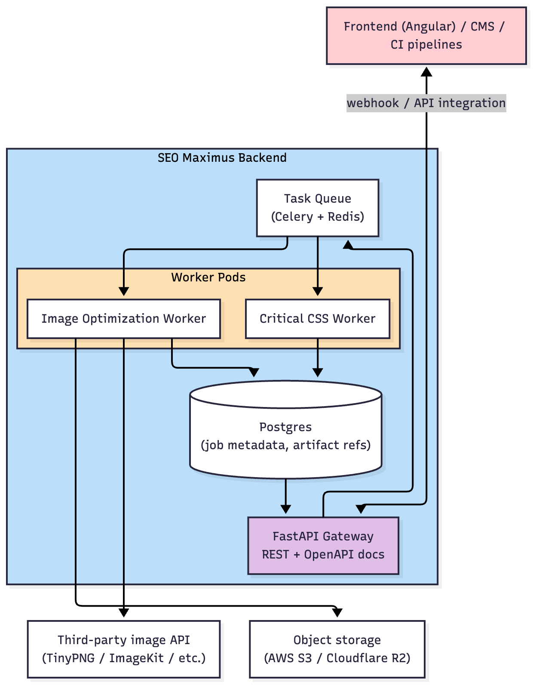

# SEO Maximus – Performance Automation MVP

## 1. Executive Summary

SEO Maximus will ship an initial automation suite focused on the two highest-impact performance optimizations:

- **Critical CSS Load Optimizer** – automatically extracts and serves above-the-fold styles for key templates.
- **Above-the-Fold Image Optimizer** – converts hero imagery to modern formats (WebP/AVIF) using a third-party API and provides prefetch instructions.

The MVP will be delivered in an accelerated **48-hour sprint (25–35 engineering hours)**. Follow-on work after the sprint will harden storage, queueing and advanced configurability.

## MVP Deliverables (48-hour sprint)

- `POST /v1/images/convert` + `GET /v1/images/{job}` returning optimized hero image data URLs (WebP plus optional second format), savings metadata, inline `` snippet, and usage instructions.
- Mobile hero detection on ~2–3 representative pages (limited viewport set), with ability to override the detected source image.
- `POST /v1/critical-css/generate` + `GET /v1/critical-css/{job}` returning above-the-fold CSS and defer instructions for the same sample pages/viewports.
- Health/auth endpoints, logging hooks, README instructions for consuming the outputs.
- Optional lightweight validation view (internal only) so stakeholders can see both optimizers working together. Production UI remains with the client’s frontend team.

---

## 2. Goals & Non-Goals

### Goals

- Deliver production-ready FastAPI backend handling:
    - Critical CSS generation for specified URLs/templates.
    - Image optimization via a trusted third-party API (e.g., TinyPNG, ImageKit).
- Provide clear API contracts and reference client snippets for frontend integration.
- Ensure observability (logging, health checks) and safe deployment (Dockerized services).
- Support manual re-generation and retrieval of optimization artifacts.

### Non-Goals (Phase 2+)

- Limited test coverage only (MVP assumption):
    - Sample set: ~2–3 representative pages provided by the client.
    - Viewports: mobile plus optionally tablet/desktop. Wider device/browser matrix deferred.
- Bulk backlog processing (existing media library, full-site CSS sweeps).
- Multi-tenant billing, rate limiting, advanced analytics.
- Vendor-independent image processing (local encoding) – optional future fallback.
- Fully automated deployment into CMSs: we ship the optimized asset + critical CSS + usage instructions, but an installable WordPress plugin (or integrations for other platforms) is deferred.

## Phase 2 Backlog (post-MVP)

- Storage/CDN upload of optimized assets, cache invalidation workflows.
- Full-site/bulk processing jobs and scheduling.
- WordPress plugin or other CMS-specific automation.
- Multi-tenant plans, rate limiting, billing, and analytics dashboards.
- Queue hardening, retry policies, distributed workers with monitoring.
- Vendor-agnostic encoding pipeline (Sharp/libvips in-house fallback).

---

## 3. High-Level Architecture



---

## 4. Detailed Components

### 4.1 API Gateway (FastAPI)

- **Endpoints**
    - `POST /v1/images/convert` – enqueue conversion job for a new image.
    - `GET /v1/images/{job_id}` – fetch job status and optimized asset metadata.
    - `POST /v1/critical-css/generate` – enqueue CSS extraction for a URL/template.
    - `GET /v1/critical-css/{job_id}` – retrieve critical CSS payload and guidance.
    - `GET /healthz` – health check for load balancers.
- **Docs**
    - Auto-generated Swagger UI.
    - Markdown quick-start in `docs/api-guide.md`.

### 4.2 Task Execution Layer

- **Celery** with **Redis** broker for background processing.
- Provides retries, visibility into task progress, and concurrency control.
- Workers packaged as separate Docker service.

### 4.3 Image Optimization Worker

- Payload: image URL or binary upload, optional target formats.
- Steps:
    1. Download source asset.
    2. Upload to third-party API; request WebP (and AVIF if supported).
    3. Store optimized asset in configured bucket (S3/R2) or return vendor URL.
    4. Generate metadata: size reduction, format details, recommended `` + `<link rel="prefetch">`.
    5. Persist results in Postgres.
- Resiliency:
    - Graceful fallback if vendor unavailable (retry/backoff).
    - Configurable timeouts and max payload size.

### 4.4 Critical CSS Worker

- Uses **Playwright (Chromium)** bundled with necessary system dependencies/fonts.
- Workflow:
    1. Launch headless browser with stealth headers.
    2. Iterate through configured viewports (desktop, tablet, mobile).
    3. For each viewport:
        - Navigate to URL, wait for network idle/event triggers.
        - Collect CSS coverage (`page.coverage.startCSSCoverage()`).
        - Capture DOM snapshot and above-the-fold height.
    4. Merge coverage data across viewports, preserving cascade order.
    5. Compose critical CSS block; optionally minify with `csscompressor`.
    6. Generate deferral snippet for remaining CSS/JS (e.g., `media="print"` switch).
    7. Persist results + debug artifacts (screenshots, logs).
- Configurability:
    - Viewport list per project.
    - Tolerance for lazy-loaded elements (scroll nudge, mutation observer wait).
    - Optional authentication headers/cookies.

### 4.5 Persistence

- **Postgres** schema (see Section 6).
- Stores job metadata, artifact references, and audit logs.
- Use SQLAlchemy ORM with Alembic migrations.
- Optionally store large artifacts (CSS, HTML snapshots) in object storage with signed URLs.

### 4.6 Observability & Ops

- Structured logging via `structlog`.
- Error tracking: Sentry (DSN configurable).
- Metrics: basic Prometheus endpoints (task success/failure, duration).
- Deployment: Docker images pushed to container registry, orchestrated on ECS Fargate or Cloud Run. Staging + production environments.

---

## 5. API Contracts (MVP)

### 5.1 `POST /v1/images/convert`

- **Headers**: `Authorization: Bearer <token>`
- **Body**
    
    ```json
    {
       "source_url":"https://cdn.example.com/hero.jpg",
       "asset_key":"home-hero",
       "prefetch":true,
       "formats":[
          "webp"
       ]
    }
    ```
    
- **Responses**
    - `202 Accepted` with `{ "job_id": "img_123", "status": "queued" }`
    - Errors: `400` (validation), `401`, `429`, `500`.

### 5.2 `GET /v1/images/{job_id}`

```json
{
   "job_id":"img_123",
   "status":"completed",
   "source_url":"https://cdn.example.com/hero.jpg",
   "optimized_assets":[
      {
         "format":"webp",
         "url":"https://assets.seomaximus.com/home-hero.webp",
         "bytes":45213,
         "savings_percent":67.4
      }
   ],
   "prefetch_tag":"<link rel=\"prefetch\" href=\"https://assets.seomaximus.com/home-hero.webp\" as=\"image\">",
   "img_snippet":""
}
```

### 5.3 `POST /v1/critical-css/generate`

```json
{
   "target_url":"https://demo-client.com/",
   "template":"home",
   "viewport_profiles":[
      "desktop",
      "mobile"
   ],
   "auth_headers":null
}
```

- Response: `202 Accepted` with job ID.

### 5.4 `GET /v1/critical-css/{job_id}`

```json
{
   "job_id":"css_456",
   "status":"completed",
   "template":"home",
   "critical_css":"/* minified critical CSS */",
   "defer_instructions":{
      "description":"Swap stylesheet once page is interactive",
      "snippet":"<link rel=\"preload\" href=\"/static/app.css\" as=\"style\" onload=\"this.rel='stylesheet'\">"
   },
   "viewports":{
      "desktop":{
         "height":900,
         "width":1440
      },
      "mobile":{
         "height":740,
         "width":390
      }
   },
   "artifacts":{
      "screenshots":[
         "https://assets.seomaximus.com/css_456/mobile.png"
      ]
   }
}
```

---

## 6. Data Model (Draft)

| Table | Key Fields | Notes |
| --- | --- | --- |
| `image_jobs` | `id`, `asset_key`, `source_url`, `status`, `created_at`, `completed_at`, `prefetch_tag`, `img_snippet`, `vendor_job_id` | Status enum: queued, processing, completed, failed. |
| `image_variants` | `id`, `job_id`, `format`, `url`, `bytes`, `savings_percent` | One-to-many with `image_jobs`. |
| `css_jobs` | `id`, `template`, `target_url`, `status`, `viewport_profiles`, `critical_css`, `defer_snippet`, `notes`, `created_at` | Store CSS in text column (compressed) or pointer to S3. |
| `job_logs` | `id`, `job_id`, `kind`, `message`, `timestamp` | For traceability/debugging. |
| `api_keys` (optional MVP) | `id`, `name`, `hashed_key`, `role`, `created_at`, `last_used_at`, `revoked` | Enables multiple integrations. |

Alembic migrations will initialize schema and provide upgrade path.

---

## 7. Third-Party Integration Details

### Image API (TinyPNG/TinyJPG)

- REST API with simple POST uploads.
- Supports WebP output; AVIF currently beta – confirm.
- Authentication via API key.
- Pricing: free tier 500 compressions/month then ~$0.002 per. Monitor via vendor dashboard.

Alternative: ImageKit or Cloudinary if CDN/transformation pipeline preferred. Abstraction layer allows swapping vendors later.

### Storage

- Expect existing AWS S3 bucket; configure IAM user with scoped permissions.
- Use pre-signed PUT for frontend uploads if needed later.

### Playwright Runtime

- Docker image based on `mcr.microsoft.com/playwright/python:v1.45.0-focal`.
- Include fonts, fallback CA certificates, and OS packages.
- Provide environment variables for stealth (User-Agent, Accept-Language).

---

## 8. Testing Strategy

- **Unit tests** (Pytest): validation schemas, vendor client wrappers, job orchestrators.
- **Integration tests**:
    - Mock third-party API using `responses` or local stub to verify retry logic.
    - Playwright smoke test against controlled pages (hosted test fixtures).
- **Performance smoke**: ensure concurrent jobs under 1–2 min for typical pages.
- **QA staging**: deploy to staging environment with feature flag to run on sample URLs.

---

## 9. Deployment Plan

1. Build Docker images via GitHub Actions (lint, tests, image push).
2. Deploy to AWS ECS Fargate (or Cloud Run) using IaC (Terraform/CloudFormation). MVP can use manual provisioning + docker-compose on Railway if faster.
3. Configure environment variables via Secrets Manager:
    - `TINYPING_API_KEY`, `DATABASE_URL`, `REDIS_URL`, `SENTRY_DSN`, `JWT_SECRET`, etc.
4. Set up logging to CloudWatch/Stackdriver.
5. Provision CI/CD pipeline to run migrations automatically before deployment.

---

## 10. Timeline & Effort (48-hour MVP Sprint)

| Day | Focus | Key Deliverables |
| --- | --- | --- |
| Day 1 (Hours 0–12) | Environment & Image Optimizer | Wire TinyPNG client, run hero detection on sample pages, ensure `/v1/images/convert` + status endpoint return optimized data URLs + metadata. |
| Day 1-2 (Hours 12–25) | Critical CSS Extraction | Playwright viewport sweep (limited set), coverage merge, inline CSS + defer snippet output, job orchestration for `/v1/critical-css`. |
| Day 2 (Hours 25–30) | Integration Validation | Verify both APIs end-to-end, add proxy-aware middleware for Railway, smoke deploy. Optional internal validation page for demo. |
| Day 2 (Hours 30–35) | Polish & Handoff | README/runbook updates, usage instructions, backlog notes for storage/upload + queue hardening, short screencast. |
- Estimated effort: **25–35 hours**.
- Contingency: sprint includes ~5 hours buffer for debugging external pages and TinyPNG rate limits.
- Dependencies: TinyPNG API key, Redis (optional for MVP since Celery runs eager).

---

## 11. Risks & Mitigations

| Risk | Impact | Mitigation |
| --- | --- | --- |
| Third-party API downtime | Image jobs fail | Implement retries + fallback queue, monitor vendor status. |
| Playwright blocked by target site | CSS job incomplete | Use stealth headers, optional proxy rotation, configurable wait hooks. |
| Changes in frontend structure | CSS becomes stale | Provide re-run endpoint + schedule nightly regeneration. |
| Large CSS bundles | Slow generation | Streamline coverage merging, enable per-template viewport throttling. |
| December 1 launch crunch | Miss deadline | Weekly demos, maintain burn chart, prioritize MVP endpoints first. |

---

## 12. Handoff Checklist

- ✅ FastAPI service with OpenAPI docs.
- ✅ Docker Compose for local dev + instructions.
- ✅ Celery worker + Redis configuration.
- ✅ Image optimization client with integration tests.
- ✅ Playwright critical CSS worker with sample outputs.
- ✅ Postgres migrations applied.
- ✅ README and runbook describing how to consume API outputs (optimized image data URLs, critical CSS, instructions).